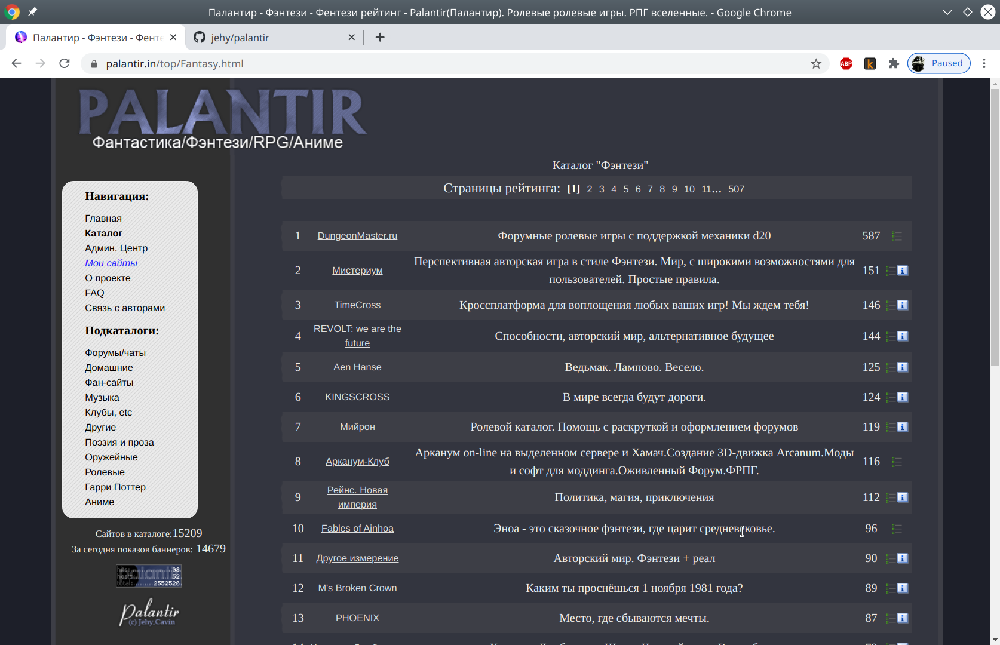

## Старый добрый каталог фентези ресурсов



###  Софтварные требования:
* Nginx
* PHP-FPM, минимальная версия - php 7.0 (лучше 7.4), опция `short_open_tags=On`, остальное по дефолту.
* mysql \ mariadb 5
* Расширения php. Точно не помню, но gd и mbstring как минимум.

###  Для установки:
* Разверните этот репозиторий
* Импортируйте базу и банеры из дампов в архивах в `https://github.com/jehy/palantir/releases/`
* Настройте Nginx, согласно palantir.in.conf
* Используйте `crontab.conf` для того, чтобы настроить сброс счётчиков и генерация сайтмапа
* Скопируйте `docs/scripts/db.sample.inc` в `db.inc` и выставьте креды к базе
* На Google Compute Engine и Yandex Cloud закрыт 25 порт и отсылать почту нельзя. Не будет работать восстановление пароля и связь с авторами.
Чтобы работало - надо, например, установить postfix и настроить интеграцию с mailgun. Там есть бесплатный лимит типа 1000 сообщений - хватит за глаза.
* В движке используются свои расширения файликов `.inc`. Если их не настроить в нгинксе, то они будут выдаваться как есть.
А там есть, например, креды к базе. По хорошему, надо быпереписать файлики на `.php` - но тогда надо добавить проверку, чтобы их не дёргали напрямую.
Ну или пока можно добавить вот такую штуку. Кстати, пункт из неё про гит нужно добавить обязательно:
```
# this will prevent files like .htaccess .htpassword .secret .git .svn etc from being served
# You can remove the log directives if you wish to
# log any attempts at a client trying to access a hidden file

location ~ /\. { deny all; access_log off; log_not_found off; }

location ~ (\.git){ return 404; access_log off; log_not_found off; }

# do not serve temp files
location ~ ~$           { access_log off; log_not_found off; deny all; }

location ~ (\.inc) {
    return 404;
    }

    location ~ /\.ht {
        deny  all;
    }
```
* У сайта есть админка, чтобы войти в неё - надо прописаться в табличке `auth`. В процессе миграции часть админки не была переписана, если
файл начинается с `die('Not rewritten!');` - это оно.
* Запускайте, вы восхитительны!
